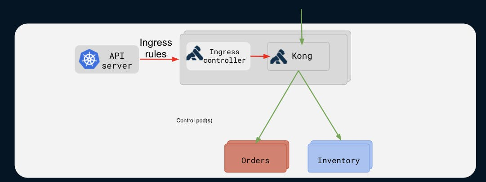

# Overview

In this workshop, you’ll learn about Kong for Kubernetes, a fully native Kubernetes Ingress Controller for enhanced API management. Kong for Kubernetes can manage ingress traffic and impose policies for you. You can configure all of Kong using Custom Resources Definitions (CRDs) with Kong for Kubernetes.

Kubernetes is the de-facto platform for container orchestration.  To expose services outside of the cluster, Kubernetes requires Ingress resources to be defined.   When services are exposed outside the cluster, they should be protected and secured.  Requirements such as authentication, observability of the traffic, auditing, encryption, integrations with other solutions becomes critical to manage for Ingress management.  

Kong is a next generation Service Control Platform that provides policy, health checking, load balancing and more to services running in and outside Kubernetes.  In Kubernetes, Kong provides a world class ingress management platform that can be managed using native tooling (i.e. kubectl, manifests, CRDs, helm, etc.) to manage Ingress traffic and apply policies to address the challenges of ingress management.  

In this Workshop, you will learn how the Kong Ingress Controller can easily manage ingress traffic and policies for services in a native Kubernetes way.  In particular you will perform:
* Setup a Kubernetes Cluster
* Deploy the Kong Ingress Controller
* Deploy a sample Echo Service
* Expose, Secure and Protect the Service with Kong

The Kong Ingress Controller consists of a Kubernetes Ingress, the powerful Kong gateway and CRDs to deliver all of the benefits of Kong and ingress management, natively in Kubernetes.

