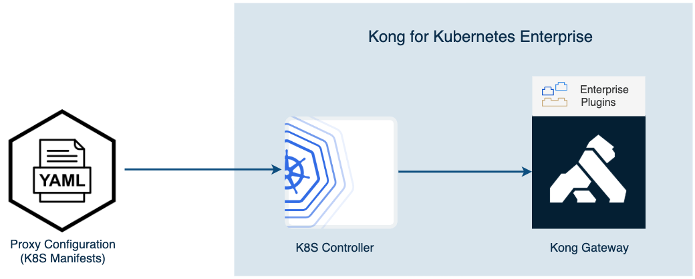

KONGratulations!
In this Workshop we got hands on experience with the Kong Ingress Controller which provides both Ingress management and policy enforcement capabilities for services in Kubernetes using native Kubernetes concepts and tooling.

In particular we deployed a sample echo service and exposed it to the outside world, protected it with rate limiting and secured it first with key authentication and then with OpenID Connect.

There’s much more we can accomplish with the Kong Ingress Controller.  Be sure to checkout our [documentation](https://docs.konghq.com/enterprise/2.1.x/kong-for-kubernetes/) and contact the Kong team with any questions.

image02.png

---
